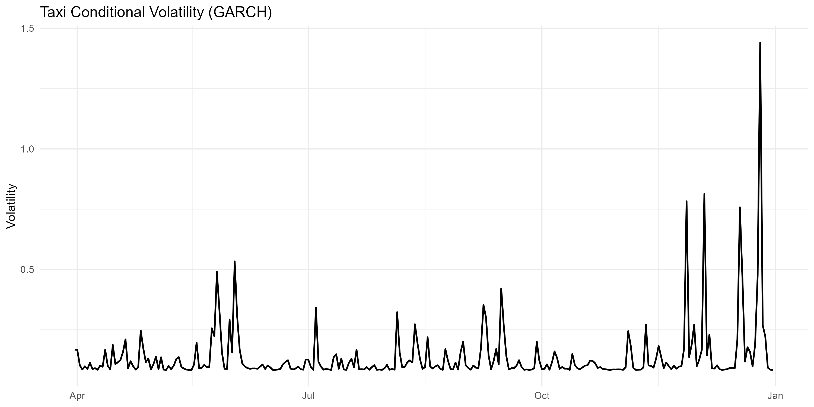
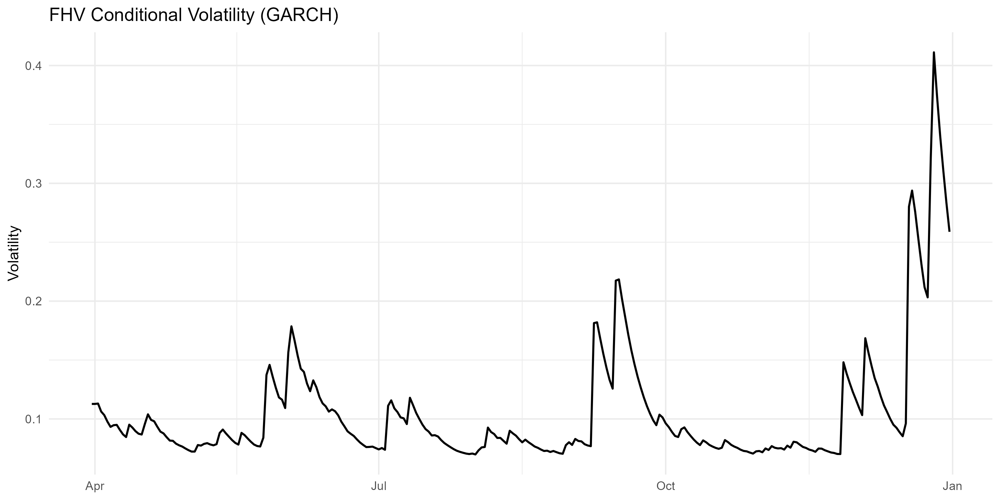

# NYC Mobility Demand Forecasting & Volatility Analysis

A complete time-series modeling pipeline analyzing daily mobility demand in New York City using Yellow Taxi and For-Hire Vehicle (FHV) data.
This project combines **ARMA models for demand dynamics** with **GARCH models for volatility estimation**, providing both predictive insights and risk interpretation.

---

## 📌 Project Overview

Urban mobility demand exhibits strong temporal dependence, structural breaks, and volatility clustering.
This project aims to:

* Model daily trip demand patterns
* Identify structural changes (COVID-19 shock)
* Forecast short-term demand behavior
* Quantify uncertainty using volatility models

---

## 📊 Dataset

* **Source**: NYC Taxi & Limousine Commission (TLC)
* **Frequency**: Daily aggregated trips
* **Services**:

  * Yellow Taxi
  * For-Hire Vehicles (Uber, Lyft, etc.)
* **Period**: 2020

---

## ⚙️ Methodology

### 1. Data Processing

* Aggregation of raw trip data into daily counts
* Separation by service type (Taxi vs FHV)

### 2. Structural Break Detection

* Major break identified: **March 22, 2020 (NY PAUSE)**
* Analysis focuses on post-shock dynamics

### 3. Transformation & Stationarity

* Log transformation (variance stabilization)
* First-order differencing (trend removal)
* Seasonal differencing (weekly pattern, lag = 7)

### 4. Statistical Testing

* Augmented Dickey-Fuller (ADF)
* KPSS test

> ✔ Result: Stationarity achieved after transformations

### 5. Model Identification

* ACF / PACF diagnostics
* ARMA order selection

### 6. ARMA Modeling

* Taxi → **ARMA(2,1)**
* FHV → **ARMA(1,2)**

### 7. Forecasting

* 30-step ahead forecasts
* Confidence intervals
* Evaluation vs actual observations

### 8. Volatility Modeling (GARCH)

* GARCH(1,1) applied to residuals
* Extraction of conditional volatility
* Forecasting uncertainty dynamics

---

## 📈 Forecast Results


---

## 📊 Volatility (GARCH)




---

## 🧠 Key Insights

* Mobility demand is highly **time-dependent**
* Strong **impact of structural shocks (COVID-19)**
* ARMA captures baseline dynamics but struggles with extreme events
* Volatility is **not constant** — clear clustering observed
* Taxi demand shows **higher volatility sensitivity** than FHV

> 🔍 Combining ARMA (mean) and GARCH (variance) provides a more complete understanding of the system.

---

## 🛠️ Technical Skills Demonstrated

| Category        | Skills                                           |
| --------------- | ------------------------------------------------ |
| Time Series     | ARMA, GARCH, ACF/PACF                            |
| Statistics      | ADF, KPSS, residual diagnostics                  |
| Forecasting     | Short-term prediction, confidence intervals      |
| Data Processing | Aggregation, transformation, feature engineering |
| Visualization   | ggplot2, publication-quality figures             |
| Programming     | R, modular scripting, reproducible workflows     |

---

## ▶️ Reproducibility

Run the entire pipeline:

```r
source("scripts/09_run_project.R")
```

All figures and processed datasets will be automatically generated.

---

## 📁 Project Structure

```
scripts/
├── 00_plot_style.R
├── 01_load_and_aggregate_data.R
├── 02_post_pause_sample.R
├── 03_transform_and_difference.R
├── 03b_differenced_distributions.R
├── 04_stationarity_tests.R
├── 04b_filtering_analysis.R
├── 05_acf_pacf_analysis.R
├── 06_arma_modeling.R
├── 07_forecasting.R
├── 08_garch_modeling.R
└── 09_run_project.R

data/
├── raw/
├── processed/

figures/
```

---

## 🎯 Conclusion

This project provides a complete end-to-end time series analysis pipeline, from raw data processing to advanced volatility modeling.

It demonstrates how combining:

* **ARMA models (mean dynamics)**
* **GARCH models (variance dynamics)**

leads to a deeper understanding of real-world systems exposed to shocks and uncertainty.

---

## 🚀 Future Improvements

* Incorporate exogenous variables (weather, policy, mobility indices)
* Extend to SARIMA / SARIMAX models
* Explore advanced volatility models (EGARCH, GJR-GARCH)
* Implement multivariate models (VAR, DCC-GARCH)

---
