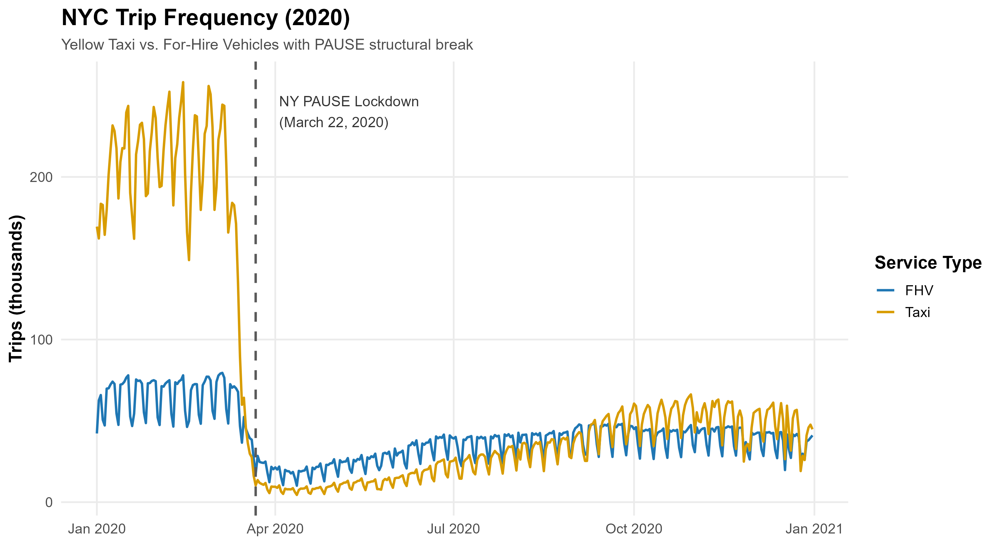

# Analyzing NYC Mobility Demand: An ARMA-GARCH Approach to Post-COVID Recovery

A quantitative analysis of demand dynamics and volatility in NYC mobility data following a major structural shock.

---

## Project Overview & Business Value

When New York City entered lockdown in March 2020, mobility demand collapsed abruptly, creating a natural experiment to study how complex systems behave under extreme disruption.

This project develops a rigorous statistical framework to analyze the recovery of urban mobility demand and quantify its uncertainty.

By applying ARMA and GARCH models to NYC Taxi and For-Hire Vehicle (FHV) data, the analysis:

1. Separates baseline demand dynamics from periods of extreme volatility
2. Compares behavioral differences between Taxi and FHV markets
3. Provides a fully reproducible analytical pipeline

---

## Data

* Source: NYC Taxi & Limousine Commission (TLC)
* Frequency: Daily aggregated trips
* Period: 2020
* Services:

  * Yellow Taxi
  * For-Hire Vehicles (Uber, Lyft, etc.)

---

## Structural Break

A major structural break occurs on **March 22, 2020** (NYC lockdown).
All modeling focuses on the post-shock period, where statistical properties are more stable.

---



---

## Methodology

### Transformation

To stabilize variance and ensure stationarity, the following transformations are applied:

* Log transformation
* First-order differencing
* Seasonal differencing (weekly pattern, lag = 7)

---

### Stationarity Testing

Two complementary tests are used:

* Augmented Dickey-Fuller (ADF)
* KPSS test

Results:

* ADF rejects the null hypothesis of a unit root (p < 0.01)
* KPSS fails to reject stationarity

The transformed series is therefore considered stationary.

---

### Model Identification

Autocorrelation analysis (ACF and PACF) is used to determine model structure.

Selected models:

* Taxi: ARMA(2,1)
* FHV: ARMA(1,1)

---

### Forecasting

Short-term forecasts are generated on the stationary series and compared to observed values.

The following figures illustrate the model’s ability to capture short-term dynamics, while highlighting its limitations during periods of high volatility.

---


---

The models capture general demand patterns but do not fully account for extreme shocks, which is a known limitation of linear time series models.

---

### Volatility Modeling (GARCH)

To account for time-varying uncertainty, a GARCH(1,1) model is applied to the residuals.

---


---

The results show clear evidence of volatility clustering and periods of elevated uncertainty following structural disruptions.

---

## Key Insights

* Mobility demand exhibits strong temporal dependence
* Structural shocks significantly alter the data-generating process
* ARMA models effectively capture baseline dynamics
* Volatility is time-varying and exhibits clustering behavior
* Taxi demand appears more sensitive to shocks than FHV demand

---

## Methodology & Technical Stack

The analysis follows a structured and reproducible pipeline:

* Language: R
* Libraries: dplyr, ggplot2, forecast, tseries, vars
* Methods: ARMA, GARCH(1,1), ADF, KPSS, ACF/PACF, Ljung-Box, AIC/BIC
* Estimation: Maximum Likelihood

---

## Reproducibility

To reproduce the full analysis:

```r
source("scripts/09_run_project.R")
```

All figures and processed datasets will be generated automatically.

---

## Project Structure

```
.
├── README.md
├── report/
├── data/
├── figures/
│   ├── main/
│   └── diagnostics/
└── scripts/
```

---

## Conclusion

This project highlights the importance of combining mean and variance modeling when analyzing real-world systems affected by structural shocks.

While ARMA models capture baseline dynamics, GARCH models reveal the underlying risk structure, providing a more complete understanding of system behavior under uncertainty.

---

## Extensions

Potential extensions include:

* Seasonal models (SARIMA)
* Incorporation of exogenous variables (weather, policy indicators)
* Multivariate modeling (VAR, DCC-GARCH)
* Regime-switching models

---
